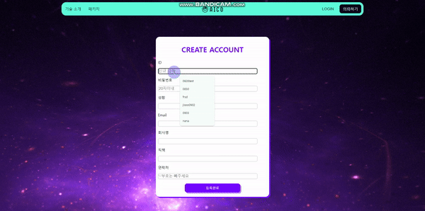
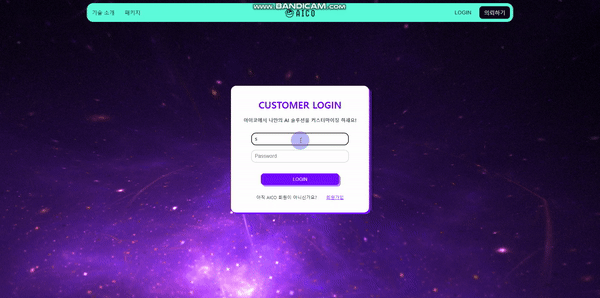
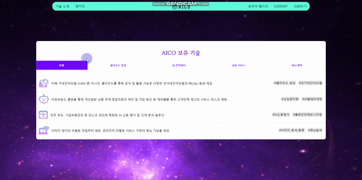
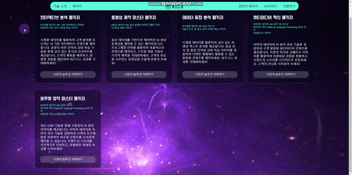
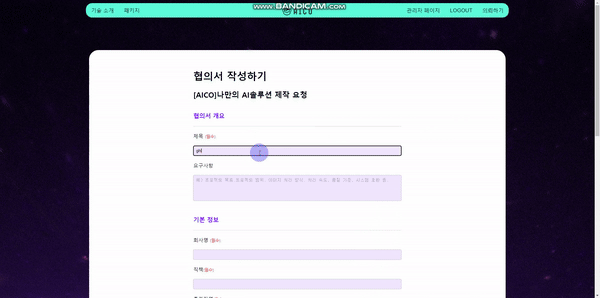
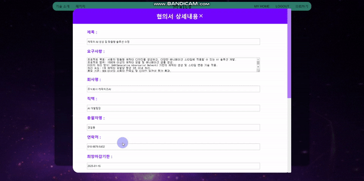
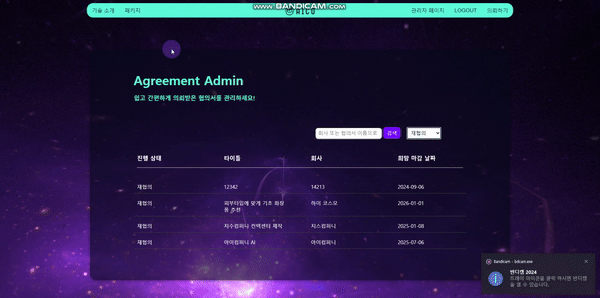

<p>
  
  # $\it{\textsf{\color{#5ad7b7} 🐬맞춤형 AI 솔루션 주문 및 관리 웹 사이트}}$
</p>

<br>

## 프로젝트 소개
AICO의 기술을 활용하여 맞춤형 AI 솔루션 제품을 주문할 수 있는 웹사이트를 개발했습니다. 이 사이트는 회원이 자신의 요구에 맞는 AI 솔루션을 쉽게 주문하고, 필요에 따라 수정 및 삭제할 수 있는 기능을 제공합니다. 또한, 관리자는 의뢰 받은 주문서를 효율적으로 관리할 수 있습니다.

## 팀원 구성 및 역할 분담
- 프론트엔드 개발
- 백엔드 개발


## 개발 환경
- Front-end : HTML, React, Redux, Axios
- Back-end : React, pgAdmin
- 버전 및 이슈 관리: Github, Visual Studio, Sourcetree
- 협업 툴: Velog, Slack
- 디자인: Figma


## 프로젝트 구조

```
├── src/                     
│   ├── components/          # 재사용 가능한 컴포넌트
│   │   ├── Header.js        # 헤더 컴포넌트
│   │   ├── Footer.js        # 푸터 컴포넌트
│   │   └── ...              # 기타 컴포넌트
│   │
│   ├── pages/                 # 페이지 컴포넌트
│   │   ├── MainPage.js        # 메인 페이지
│   │   ├── SignupForm.js      # 회원 가입 페이지
│   │   └── AgreeMasterList.js # 관리자 페이지
│   │
│   ├── redux/              
│   │   ├── apiSlice.js         # api
│   │   └── authSlice.js        # auth
│   │       
│   │
│   ├── utils/               
│   │   └── apiUrl.js        # API 호출 함수
│   │
│   ├── App.js               # 메인 애플리케이션 컴포넌트
│   ├── index.js      
│   └── styles/              # 스타일 파일
│       ├── App.css          # 전체 스타일
        └── ...              # 세부 스타일 파일

└── Dockerfile               # 도커 설정
```

## 개발 기간
- 전체 개발 기간: 2024.08.20~2024.09.05
- 데이터 베이스:2024.08.20~2024.08.22
- 기능 구현: 2024.08.20~2024.09.05
- UI 구현: 2024.08.29~2024.09.02
- 반응형 구현: 2024.09.03~2024.09.04
- 버그 리포트: 2024.09.04~2024.09.05
- 클라우트 배포: 2024.09.06~2024.09.20

## 페이지 별 기능
- 페이지별 시안을 Gif 헝태로 전시.

### [메인 화면]
<p align="left">
  
</p>

### [회원 가입]
<p align="left">
  
</p>

### [로그인]
<p align="left">
  
</p>

### [기술 소개]
<p align="left">
  
</p>

### [패키지]
<p align="left">
  
</p>

### [협의서 작성]
<p align="left">
  
</p>

### [마이 페이지]
<p align="left">
  
</p>

### [관리자 페이지]
<p align="left">
  
</p>

## 개선 목표

- 추천 패키지에 좋아요 기능 추가
  * 회원은 자신이 마음에 드는 패키지에 좋아요 누른다.
  * 좋아요 누적 수에 따라 패키지 순서를 나열한다.
- 패키지 추천 챗봇 기능 추가
  * 채팅 로봇을 통해 자신을 원하는 맞춤형 솔루션을 추천 받을 수 있다.
  * 추천 받은 솔루션으로 나만의 협의서를 작성할 수 있게 연결 시켜준다.
- 1:1 문의 챗봇 기능 추가
  * 협의서 작성, 에러 사항에 대해 회원이 보고할 수 있는 챗봇.
  * 회원에게 기본 해결책을 제공해준다.

## 에러 노트

- 깃허브 deploy
  * 몇 차례 업데이트 이후 runners 연결이 끊겨서 deploy 실패했다.
  * deploy 실패 시 깃허브 runners에서 실행중인지 꼭 확인해야 한다.
  * 만약 종료 됐을 경우 [아마존 aws - ec2 - 인스턴스 - 연결 - EC2 인스턴스 연결 탭 - 연결 클릭]에서 재 실행 시킨다.
 
- 벡엔드 데이터 가져오는 오류
  * 먼저 환경 파일을 확인한다.
  * 환경 파일이 없거나 틀렸다면 에러가 발생한다.
  * 환경 파일은 있으나 안되는 경우 깃허브에 있는 yml 파일을 확인한다.
  * yml 파일에 코드가 정확히 들어 있는지 확인한다.
  * yml 파일은 잘 되어있으나 그래도 에러가 발생하면 [깃허브 세팅스 - Actions secrets and variables - Repository secrets]에 env가 잘 들어있는 지 확인해야 한다.

- 프론트에서 CORS 오류
  * 백엔드나 프로트엔드 주소가 서로 안 맞거나 잘못 입력한 가능성이 있으니 꼭 확인한다.
  * 백엔드 cors에는 반드시 프론트 엔드 주소를 넣어야 한다.
  * 주의: 주소에 슬래시가 더 들어갔는지 꼭 확인해야 한다.
  
